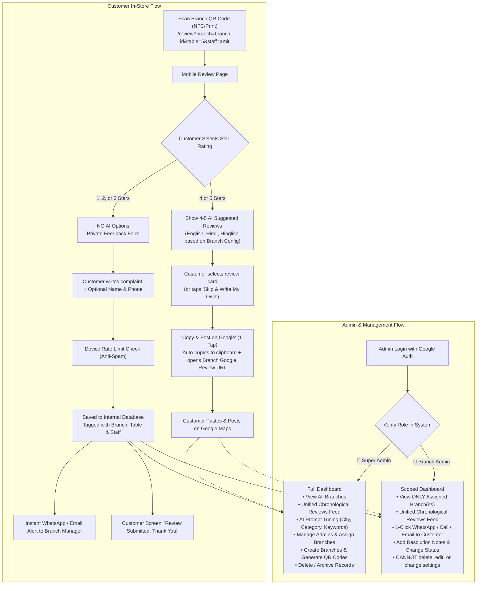
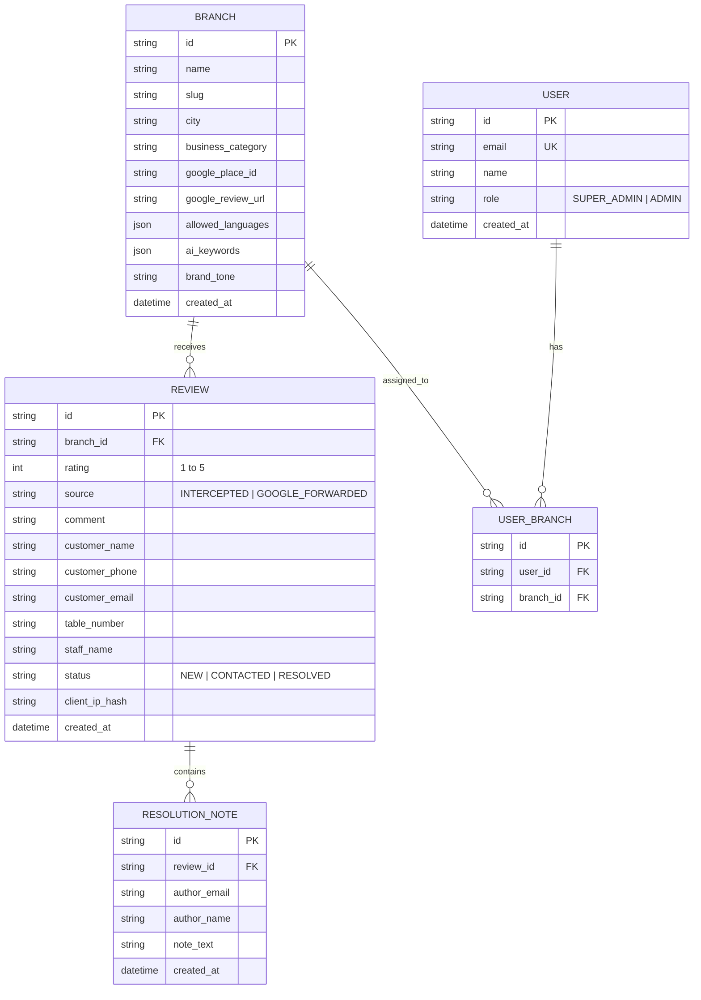

# Smart Review Management Platform — System Specification & Architecture

## 1. Executive Overview
A full-stack, multi-branch smart review platform designed to maximize positive Google Reviews (4–5★) using 1-tap AI suggestions while privately intercepting negative feedback (1–3★) for direct manager resolution.

---

## 2. Customer Review Flow Specifications

### 2.1 URL Structure
- Base URL: `https://yourdomain.com/review?branch=<branch-slug>`
- Optional Tracking Parameters:
  - `&table=<table-number>` (e.g., `&table=12`)
  - `&staff=<staff-name-or-id>` (e.g., `&staff=rajesh`)

### 2.2 Rating Scenarios
| Rating | Action / Screen | AI Suggestions | Google Link Redirect | Saved to Internal DB |
|---|---|---|---|---|
| **⭐⭐⭐⭐ or ⭐⭐⭐⭐⭐ (4–5★)** | Positive Flow |  **Yes** (English, Hindi, Hinglish configured per branch) |  **Yes** (1-tap copy + opens Google Maps) |  Logged as Google Redirect event |
| **⭐, ⭐⭐, or ⭐⭐⭐ (1–3★)** | Negative Flow (Intercepted) | ❌ **Strictly None** (Customer writes custom feedback) | ❌ **Never** (Kept private) |  **Yes** (Full feedback + contact info) |

### 2.3 4–5 Star AI Experience (1-Tap Review)
1. **Zero-Latency Smart Cache:** Suggested reviews load in 0ms (pre-generated and cached from branch AI configuration).
2. **Language Badges:** Cards marked with `[🇬🇧 English]`, `[🇮🇳 Hindi]`, `[🗣️ Hinglish]` as enabled per branch.
3. **1-Tap Action:**
   - Tapping a card highlights it.
   - Button: **"📋 Copy & Post on Google"**.
   - Tapping button writes text to device clipboard (`navigator.clipboard.writeText`) and launches the branch's Google Review URL (`https://search.google.com/local/writereview?placeid=...`).
4. **Fallback Option:** Prominent button **"Skip & Write My Own on Google"** for customers who prefer typing their own thoughts directly.

### 2.4 1–3 Star Private Interception
1. **Tone:** Empathetic and professional: *"We are sorry we didn't meet your expectations today. Please tell management what went wrong so we can fix it."*
2. **Input Fields:**
   - Freeform feedback textarea (Required).
   - Customer Name (Optional).
   - Customer WhatsApp / Phone number (Optional, with helper: *"Share your number so our manager can directly resolve this and invite you back"*).
3. **Anti-Spam Rate Limiting:** Enforces 1 review submission per device every 2–3 hours via local storage token and IP hash.
4. **Confirmation Screen:**
   - Politeness: *"Review Submitted! Thank you for sharing your experience. Our team has received your submission."*
5. **Instant Alert:** Webhook / API trigger immediately sends an alert (WhatsApp/Email) to the assigned branch manager with table and staff info.

---

## 3. Branch-Level AI Prompt Tuning

At branch creation or in settings, the Super Admin configures:
- **City & Area:** (e.g., *Connaught Place, New Delhi* or *Indiranagar, Bangalore*)
- **Business Category:** (e.g., *Fine Dining Restaurant, Luxury Salon, Dental Clinic, Gym, Sweet Shop*)
- **Top 3–5 Specialties / Highlights:** (e.g., *"Filter Coffee, Paneer Tikka, Polite Staff, Fast Service"*)
- **Brand Tone:** (e.g., *Casual & Friendly*, *Family-friendly*, *Premium & Elegant*)
- **Allowed Languages for this Branch:** Checkboxes for:
  -  English
  -  Hindi
  -  Hinglish

---

## 4. Admin Dashboard & RBAC Matrix

### 4.1 Authentication
- **Provider:** Google OAuth (Sign in with Google).
- **Access Model:** Whitelist ACL (Only approved emails in database can log in).

### 4.2 Role Permissions
| Capability | 👑 Super Admin | 👤 Branch Admin |
|---|:---:|:---:|
| View Reviews | All Branches | Assigned Branch(es) only |
| Filter by Branch, Rating, Status, Date |  Yes |  Yes (scoped to assigned branches) |
| Chronological Unified Review Feed |  Yes |  Yes |
| 1-Click WhatsApp Reply to Customer |  Yes |  Yes |
| Direct Phone Call / Email to Customer |  Yes |  Yes |
| Add Internal Notes & Update Status |  Yes |  Yes |
| Delete or Archive Reviews |  **Yes** | ❌ **No** |
| Add / Edit / Delete Branches & Google URLs |  **Yes** | ❌ **No** |
| Tune AI Prompts (City, Category, Keywords) |  **Yes** | ❌ **No** |
| Manage Team & Assign Branches |  **Yes** | ❌ **No** |

---

## 5. Unified Chronological Reviews Feed & Customer Reply System

### 5.1 Feed Presentation
All reviews appear in **descending chronological order (newest first)**:
- **Badge `[🔴 Intercepted (Private)]`:** For 1–3★ complaints captured in-app.
- **Badge `[🟢 Google Review / Forwarded]`:** For 4–5★ customer review journeys.
- **Metadata displayed:**
  - Star rating (⭐ 1 to 5).
  - Branch name & City.
  - Table number and Staff name (if captured from QR).
  - Timestamp (relative & exact, e.g., *"10 minutes ago — 27 Sep 2026, 10:15 AM"*).
  - Status: `[🔴 New]` | `[🟡 Contacted]` | `[🟢 Resolved]`.

### 5.2 1-Click Reply Actions for Intercepted Complaints
1. **💬 1-Click WhatsApp Reply:**
   - Opens WhatsApp with a pre-filled apology template:
     > *"Hi [Customer Name], this is the management at [Business Name - Branch]. We saw your feedback regarding your visit today at Table [Table Number]. We sincerely apologize for [Issue]. We would love the opportunity to make this right — please let us know how we can assist."*
2. **📞 Direct Call:** `tel:<phone>` one-touch dial.
3. **✉️ Email:** `mailto:` with pre-drafted subject and body.
4. **📝 Internal Audit Note:** Log actions taken (e.g., *"Manager Priya called customer at 10:30 AM, offered complimentary dessert coupon"*).

---

## 6. Dynamic QR Code Studio

- **QR Code Target:** `https://yourdomain.com/review?branch=<slug>`
- **Permanent Print Guarantee:** Because QR codes point to your own domain and branch slug, **printed QR codes and NFC cards never need to be reprinted**, even if:
  - The branch's Google Review URL changes.
  - The Google Place ID changes.
  - The business updates its name or AI settings.
- **Table / Staff QR Generator:** Tool in the admin panel to generate batches of table/staff specific QR codes (e.g. Table 1, Table 2... or Staff A, Staff B...).
- **Export formats:** High-resolution PNG and SVG formats suitable for acrylic stands, stickers, and cards.

---

## 7. Data Schema (Entities & Relationships)

