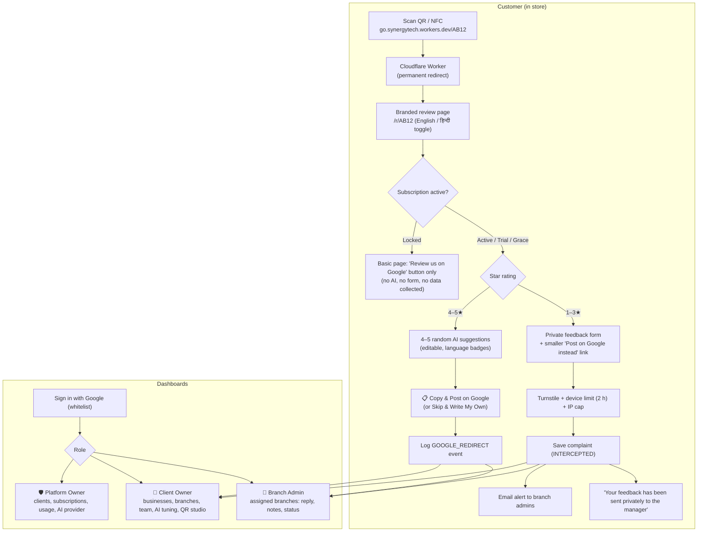
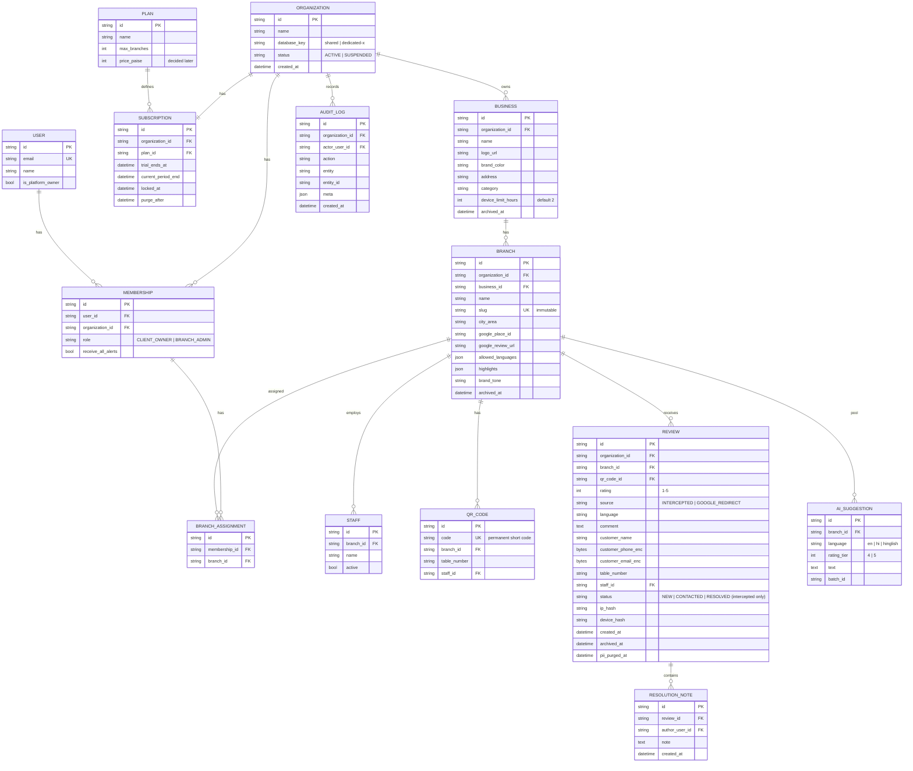

# Smart Review Platform by Synergy Technologies — Final Specification (v1.0)

> Status: **Confirmed**, 27 Sep 2026. This document supersedes [`ORIGINAL_SPEC.md`](./ORIGINAL_SPEC.md).
> Every decision below was agreed in the requirements discussion. Change it here first, before changing code.

---

## 1. Product Overview

A **multi-tenant SaaS** that Synergy Technologies sells to businesses on a **yearly subscription**. Each client can register several businesses, each with its own branding and branches. Customers scan a QR code at a branch and then:

- **4–5★:** get editable, AI-suggested review text and a 1-tap "Copy & Post on Google" button.
- **1–3★:** are shown a private feedback form first. The complaint goes straight to the branch manager for resolution. A smaller "post publicly on Google" link stays visible to every customer.

All of a client's businesses and branches appear in **one unified dashboard**.



---

## 2. Tenancy Model

```
Platform (Synergy Technologies)
 └── Client Account (Organization)        ← subscription lives here
      └── Business (own branding)          ← e.g. "Sharma Sweets", "Sharma Dental"
           └── Branch                      ← e.g. "Connaught Place", Google Place ID
                ├── Staff (managed list)
                └── QR Codes (branch / table / staff)
```

- **Branding per business:** logo, display name, address, brand colour(s).
- Clients see every business and branch in one dashboard, with filters by business and branch.
- **"Powered by Synergy Technologies"** appears in the footer of every customer page.
- **No client custom domains.** Everything runs on the platform's domain.
- **Onboarding:** in phase 1 the Platform Owner creates client accounts. Self-signup with a free trial comes in phase 2.

---

## 3. Roles & Permissions (RBAC)

| Capability | 🛡️ Platform Owner | 👑 Client Owner | 👤 Branch Admin |
|---|:---:|:---:|:---:|
| Create / suspend client accounts, renew subscriptions | ✅ | ❌ | ❌ |
| Platform settings (AI provider, usage meter) | ✅ | ❌ | ❌ |
| Add / edit businesses, branding, branches, Google URLs | ✅ | ✅ | ❌ |
| Tune AI prompts (city, category, highlights, tone, languages) | ✅ | ✅ | ❌ |
| Manage team, assign branches | ✅ | ✅ | ❌ |
| Staff list & QR studio | ✅ | ✅ | ❌ |
| View reviews feed & analytics | All clients | Own account | Assigned branches only |
| WhatsApp / call / email customer, notes, change status | ✅ | ✅ | ✅ |
| Archive (soft delete) reviews | ✅ | ✅ | ❌ |
| Permanently delete reviews | ✅ | ✅ | ❌ |

- There is no separate "Business Admin" role. A Branch Admin can be assigned every branch of a business.
- A user can belong to more than one client account. Access is always evaluated per account.

### Authentication
- **Sign in with Google** (Auth.js) only. No passwords are stored.
- **Whitelist:** only emails invited to an account can log in. Any Gmail or Google Workspace address is allowed.
- **First Platform Owner:** set through the `PLATFORM_OWNER_EMAILS` environment variable and editable later. It must be a real Google account.
- Removing a user revokes their sessions immediately.

---

## 4. Customer Flow

### 4.1 QR codes & URLs
- A QR code encodes a **permanent short code**: `https://go.synergytech.workers.dev/<code>`.
- A **Cloudflare Worker** (free) redirects the code to the app at `/r/<code>`. If the app's host or domain changes, only the Worker's target changes, and **printed QR codes never need reprinting.**
- The short code resolves to *branch + optional table + optional staff member*. Staff come from the managed list, so names can't be forged by editing the URL.
- **Branch slugs are locked** once the branch is created. Names, Google URLs and Place IDs can change freely.

### 4.2 4–5★ positive flow
1. Show **4–5 random suggestions** from the branch's pre-generated pool, which loads instantly.
2. Wording differs for 4★ and 5★. Some suggestions mention the staff member when the QR carries one.
3. Language badges: 🇬🇧 English, 🇮🇳 Hindi (Devanagari), 🗣️ Hinglish (Roman script), as enabled for the branch.
4. Cards are **editable** before copying, so the customer can make the review their own.
5. **"📋 Copy & Post on Google"** copies the text to the clipboard and opens the branch's Google review URL.
6. **"Skip & Write My Own on Google"** is always visible.
7. Each Google click is logged as a `GOOGLE_REDIRECT` event. The system cannot confirm that the review was actually posted; importing real Google reviews is phase 2.

### 4.3 1–3★ private-first flow
1. Message: *"We are sorry we didn't meet your expectations today. Please tell management what went wrong so we can fix it."*
2. Fields: feedback (required), name (optional), WhatsApp/phone (optional), with a DPDP consent line under the phone field.
3. A smaller **"Prefer to post publicly? Review us on Google"** link is shown to **every** 1–3★ customer.
4. Confirmation: *"Thank you — your feedback has been sent privately to the manager."*
5. Anti-spam:
   - Cloudflare Turnstile (invisible captcha).
   - One complaint per **device every 2 hours**, configurable per business.
   - A loose cap per hashed IP (default 50/hour), so customers sharing restaurant Wi-Fi are not blocked.

> **Policy rule (non-negotiable):** the system never selectively routes some low ratings to Google and hides others. All 1–3★ customers get the same options. Google Business Profile policy prohibits selective solicitation ("review gating"), and breaching it risks every client's listing.

### 4.4 After resolution
When a complaint is marked **Resolved**, the follow-up message template (WhatsApp or email) includes the Google review link. The template is the same for every resolved complaint; there is no per-customer selection.

### 4.5 Customer page language
English by default, with a Hindi toggle.

---

## 5. AI Suggestions

- **Provider abstraction:** Gemini (default, free tier), Claude and OpenAI. The Platform Owner switches provider in settings, and further providers can be added as adapters.
- **Inputs per branch:** city & area, business category, 3–5 highlights, brand tone, enabled languages, and the staff list (for name mentions).
- **Pool:** 100 suggestions per branch per enabled language, split between 4★ and 5★ wording. The pool is **regenerated weekly** and whenever the AI settings change. It replaces the old pool rather than adding to it.
- **Safety:** customers never send text to the AI. Only business settings go into prompts, with no customer data. Output is validated (length, language, no URLs or phone numbers) before it is stored.

---

## 6. Alerts & Escalation

- **Phase 1:** email alerts (Gmail / Google Workspace SMTP, or Resend) to every admin assigned to the branch. Client Owners can opt in to all alerts.
- **Escalation:** a complaint still **New after 1 day** triggers a re-alert to the Client Owner(s).
- **Phase 2:** WhatsApp Business API alerts, once Meta verification and template approval are done.
- The 1-click **WhatsApp reply** (`wa.me` link with a pre-filled apology), `tel:` and `mailto:` all work from day one.

---

## 7. Dashboard

- **Unified feed**, newest first, across all businesses and branches the user can access.
- Badges: `🔴 Intercepted (Private)`, `🟢 Google Redirect`.
- Metadata: stars, business, branch, city, table, staff, relative and exact timestamps.
- **Status** (`New` → `Contacted` → `Resolved`) applies to intercepted complaints only.
- Filters: business, branch, rating, source, status, date range.
- Actions: WhatsApp, call, email, internal resolution notes (author and time recorded).
- **Analytics tab (MVP):**
  - Average rating and trend.
  - Volume by rating.
  - Google-click rate.
  - Complaints by status.
  - Breakdown by branch, staff and table.
- **QR studio:** branch, table-batch and staff QR codes, exported as high-resolution PNG and SVG, with optional business branding.

---

## 8. Subscription & Locking

| Item | Rule |
|---|---|
| Unit | Per **client account**. A plan sets `max_branches`; prices are decided later. |
| Term | **1 year** |
| Payment | Phase 1: offline, with the Platform Owner clicking **Renew 1 year**. Phase 2: Razorpay. |
| Trial | Optional, 14 days by default, set per client |
| Reminders | Emails 30, 7 and 1 day before expiry |
| Grace | 7 days after expiry: fully working, with a renewal banner |
| Locked | Dashboard shows the renewal screen only. Customer QR page shows a basic "Review us on Google" button: no AI, no form, **no customer data collected**. |
| Retention | Data kept for **90 days** after locking, then deleted, with a warning email beforehand |
| Renewal | Everything resumes instantly: same QR codes, data and settings |

Subscription states: `TRIAL → ACTIVE → GRACE → LOCKED → (PURGED)`. A state is always **computed from dates on the server**, never trusted from the client.

---

## 9. Privacy (India DPDP Act)

- A consent line is shown wherever a phone number or email is collected.
- Customer personal data (name, phone, email) is deleted or anonymised **12 months** after a review is created.
- IP addresses are stored only as salted hashes.
- Data of locked accounts is purged after 90 days (§8).

---

## 10. Security Baseline

No system can promise zero bugs. This is the design standard, and every item must be met before launch.

1. **Tenant isolation.** Every query is scoped server-side by organization, through a single data-access layer. Automated tests attempt cross-tenant reads and writes and must fail.
2. **Authorization on every request.** Role and branch checks run on the server for every page, API route and server action. The browser is never trusted.
3. **Sessions.** Secure, HttpOnly, SameSite cookies, CSRF protection, and immediate revocation when a user is removed.
4. **Encryption.** Customer phone and email are encrypted at the field level with a key held outside the database. TLS is used everywhere.
5. **Input and output.** Every input is validated with schemas. React escapes output, and raw HTML injection is forbidden. A strict Content Security Policy and security headers (HSTS, X-Frame-Options, etc.) are set.
6. **Uploads.** Logos are PNG or JPG only, size-limited and re-encoded; SVG is blocked. Uploads are stored in Cloudflare R2.
7. **Abuse control.** Turnstile and rate limits on every public endpoint.
8. **Secrets.** Kept in hosting environment variables only, never committed. Secret scanning and dependency alerts are enabled.
9. **Audit log.** Every admin action is recorded: who did what, to which record, and when.
10. **Backups.** Scheduled database backups, with the restore procedure documented and tested.
11. **Before launch.** An internal security review, plus a recommended independent penetration test before the first large client.

---

## 11. Architecture & Hosting (free tier first)

| Layer | Choice | Notes |
|---|---|---|
| App | Next.js (App Router, TypeScript), Tailwind | |
| Hosting | Vercel Hobby for development and pilot | Hobby is non-commercial. Move to Vercel Pro or Cloudflare at the first paying client; the code stays portable. |
| Database | PostgreSQL on Neon (free 0.5 GB), Prisma ORM | Single shared database (§12) |
| Auth | Auth.js with Google OAuth | |
| Email | Google Workspace SMTP with an app password (about 2,000 a day) | Resend supported as an alternative |
| AI | Gemini free tier by default; Claude and OpenAI switchable | Provider adapters |
| Captcha | Cloudflare Turnstile | Free |
| File storage | Cloudflare R2 | Free 10 GB |
| QR redirect | Cloudflare Worker at `go.synergytech.workers.dev` | Free; commercial use allowed |
| Scheduled jobs | GitHub Actions cron calling protected endpoints | AI pool refresh, escalation, reminders, locking, retention purge |
| Domain | None in phase 1 | Buy a Synergy domain later and point the Worker at it |

Free-tier limits change, so verify them at signup. The **Platform Owner usage meter** shows database size, emails sent and AI calls against the limits.

---

## 12. Database Strategy

- **One shared database.** Every tenant-owned row carries `organization_id`.
- **Database router:** each organization has a `database_key` field (default `shared`). A large client can later be moved to a **dedicated database** with no code change, sold as a Premium or Enterprise plan.
- Logos and images live in R2, not in the database. The AI pool is replaced rather than accumulated, which keeps the database small.

### Data model



---

## 13. Phasing

**Phase 1 (MVP)**
- Multi-tenant accounts, roles and whitelist login.
- Businesses, branding, branches, staff and QR studio (with the Cloudflare Worker redirect).
- Customer flow with AI suggestions (provider-switchable), the private complaint flow and anti-spam.
- Email alerts and 1-day escalation.
- Unified feed, reply actions and notes.
- Basic analytics.
- Yearly subscription lifecycle with manual renewal, reminders, grace, lock and purge.
- DPDP retention, audit log and the security baseline (§10).
- Platform Owner usage meter.

**Phase 2**
- WhatsApp Business alerts.
- Razorpay online payments and self-signup with trial.
- Google review import (Business Profile API).
- Advanced analytics.
- Dedicated-database migration tooling.

---

## 14. Decisions Deferred

- Subscription prices and plan tiers.
- Purchase of a Synergy Technologies domain (the Worker target changes; the QR codes do not).
- Choice of penetration-testing firm before the first large client.

---

## 15. Implementation Notes (Phase 1 build)

Where the build differs from the text above, and why:

| Topic | Spec said | Built | Reason |
|---|---|---|---|
| Logo storage | Cloudflare R2 | Stored in Postgres (re-encoded 256×256 PNG, a few KB each) | One fewer service to set up; tiny footprint. Can move to R2 later without UI changes. |
| Sign-in library | Auth.js | Google OAuth via `arctic` + own database sessions | Full control over the invite whitelist and instant session revocation; less code to audit. |
| Plan table | Separate `PLAN` table | Plan name and branch limit stored on each subscription | Prices are not decided yet; a plan catalogue arrives with Razorpay billing in phase 2. |
| Analytics tile “4–5★ who went to Google” | Share of happy customers who clicked | “Sent to Google” count | Phase 1 does not log 4–5★ ratings that don’t click through, so a share can’t be computed honestly. |
| Scheduled jobs | GitHub Actions or cron-job.org | GitHub Actions (`.github/workflows/cron.yml`) | Free, and lives in the repo. |
| Original link format | `/review?branch=<slug>&table=5` | Still supported; forwards to the permanent `/r/<code>` page | Backwards compatible with any early printed links. |
